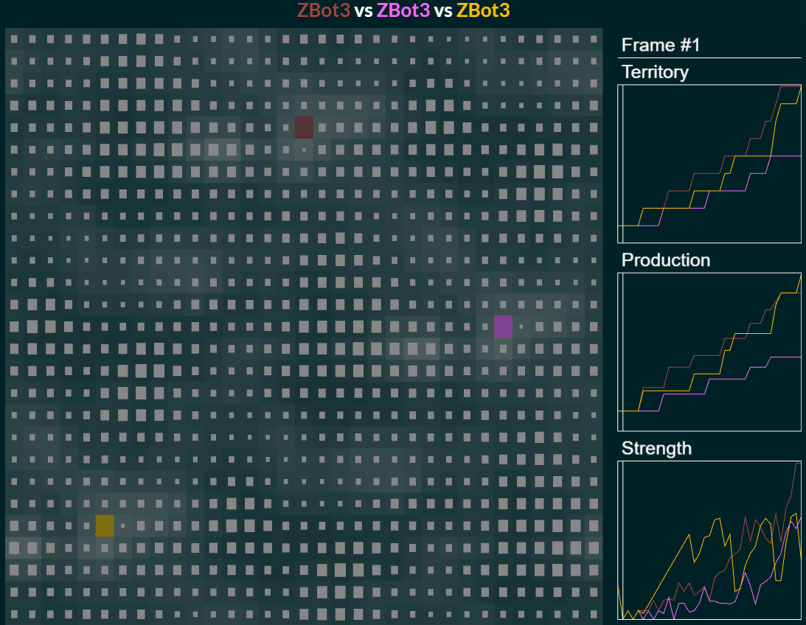

# Project Raiju
**Raiju** is a reinforcement learning experiment for Halite, an AI programming 
competition where bots face off in a game with "a branching factor billions of 
times higher than that of Go".

## Proposals
 - Information about prev. move.
 - Provide inter-piece communication
 - Include board size, time to last match
 - Distinguish between enemy squares/pieces

## References
 - https://www.halite.io/
 - http://torch.ch/blog/2016/04/30/dueling_dqn.html
